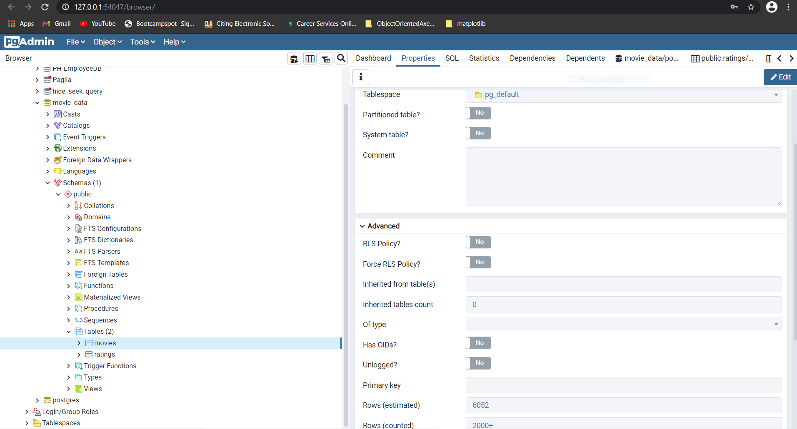
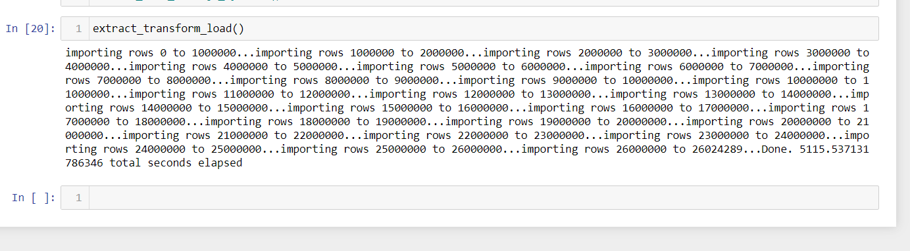

# Movie ETL

In this challenge I created an automated pipeline that takes in new data, performs the appropriate transformations, and loads the data into existing tables.

One function was created that took in the three files—Wikipedia data, Kaggle metadata, and the MovieLens rating data—and performed the ETL process by adding the data to a PostgreSQL database.

